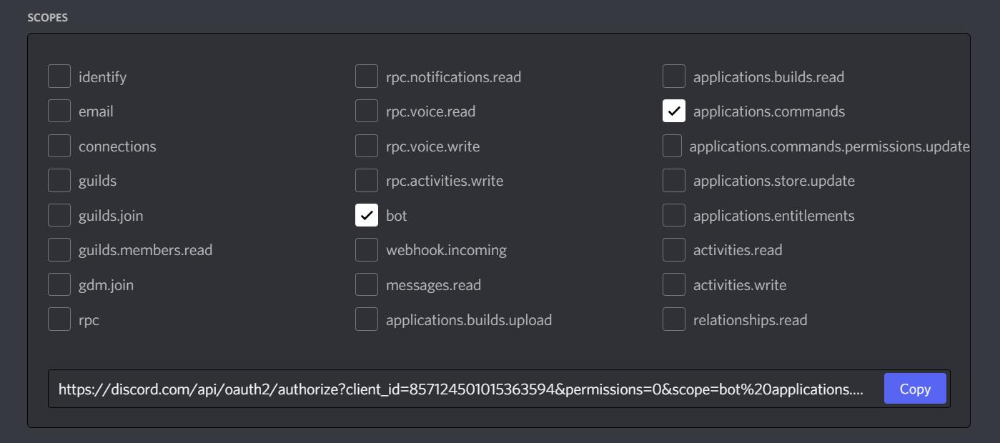

# Inviting your bot

So, you've made the bot account, but it is not actually in any server. If you want to invite your bot you must create an invite URL for it.

1. Make sure you’re logged on to the [Discord website][discord-page].

2. Navigate to the [application page][discord-app-page].

3. Click on your bot’s page.

4. Go to the `OAuth2` tab.

     
    

        { width="75%" }
    

     

5. Tick the `bot` checkbox under `scopes`.

     
    

        { width="75%" }
    

     

    - If you would like to integrate slash commands and other interactions into your bot, make sure to check the `applications.commands` scope as well.

     
    

        { width="75%" }
    

     

6. Tick the permissions required for your bot to function under `Bot Permissions`.

    - Please be aware of the consequences of requiring your bot to have the `Administrator` permission.

    - Bot owners must have 2FA enabled for certain actions and permissions when added in servers that have Server-Wide 2FA enabled. Check the [2FA support page][discord-2fa-page] for more information.

     
    

        { width="75%" }
    

         

7. Now the resulting URL can be used to add your bot to a server. Copy and paste the URL into your browser, choose a server to invite the bot to, and click `Authorize`.

    !!! Note

        The person adding the bot needs "Manage Server" permissions to do so.

If you want to generate this URL dynamically at run-time inside your bot and using the [`disnake.Permissions`]({{ disnakedocs }}/api.html#disnake.Permissions) interface, you can use [`disnake.utils.oauth_url()`]({{ disnakedocs }}/api.html#disnake.utils.oauth_url).

[discord-page]: https://www.discord.com
[discord-app-page]: https://discord.com/developers/applications
[discord-2fa-page]: https://support.discord.com/hc/en-us/articles/219576828-Setting-up-Two-Factor-Authentication