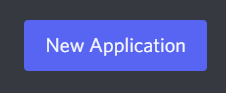

# Creating your application

The steps mentioned further in this markdown are essentially a copy of the steps [mentioned in the docs]({{ disnakedocs }}/discord.html). Therefore, you can follow the steps from either resource.

!!! Note

    If you have already made your bot application, you can skip this document and move on to [`coding-your-bot`](./102-coding-your-bot.md).

## Creating a bot account

In order to work with the library and the Discord API in general, we must first create a Discord Bot account.

Creating a Bot account is a pretty straightforward process.

1. Make sure you’re logged on to the [Discord website][discord-page].

2. Navigate to the [application page][discord-app-page].

3. Click on the `New Application` button.

     
    

        { width="40%" }
    

     

4. Give the application a name and click `Create`.

     
    

        { width="75%" }
    

     

5. Create a Bot User by navigating to the `Bot` tab and clicking `Add Bot`.
    - Click `Yes, do it!` to continue.

     
    

        { width="75%" }
    

     

6. Make sure that `Public Bot` is ticked if you want others to invite your bot.
    - You should also make sure that `Require OAuth2 Code Grant` is unchecked unless you are developing a service that needs it. If you’re unsure, then **leave it unchecked**.

     
    

        { width="75%" }
    

     

7. Copy the token using the `Copy` button.

    - This is **not** the Client Secret at the General Information page.

And that’s it. You now have a bot account and you can login with that token.

### Regarding bot tokens

!!! Warning

    It should be worth noting that this token is essentially your bot’s password. You should **never** share this with someone else. In doing so, someone can log in to your bot and do malicious things, such as leaving servers, ban all members inside a server, or pinging everyone maliciously.

    The possibilities are endless, so do not share this token.

    If you accidentally leaked your token, click the “Regenerate” button as soon as possible. This revokes your old token and re-generates a new one. Now you need to use the new token to login.

### Inviting your bot

So, you've made the bot account, but it is not actually in any server. If you want to invite your bot you must create an invite URL for it.

1. Make sure you’re logged on to the [Discord website][discord-page].

2. Navigate to the [application page][discord-app-page].

3. Click on your bot’s page.

4. Go to the `OAuth2` tab.

     
    

        { width="75%" }
    

     

5. Tick the `bot` checkbox under `scopes`.

     
    

        { width="75%" }
    

     

    - If you would like to integrate slash commands and other interactions into your bot, make sure to check the `applications.commands` scope as well.

     
    

        { width="75%" }
    

     

6. Tick the permissions required for your bot to function under `Bot Permissions`.

    - Please be aware of the consequences of requiring your bot to have the `Administrator` permission.

    - Bot owners must have 2FA enabled for certain actions and permissions when added in servers that have Server-Wide 2FA enabled. Check the [2FA support page][discord-2fa-page] for more information.

     
    

        { width="75%" }
    

         

7. Now the resulting URL can be used to add your bot to a server. Copy and paste the URL into your browser, choose a server to invite the bot to, and click `Authorize`.

    !!! Note

        The person adding the bot needs "Manage Server" permissions to do so.

If you want to generate this URL dynamically at run-time inside your bot and using the [`disnake.Permissions`]({{ disnakedocs }}/api.html#disnake.Permissions) interface, you can use [`disnake.utils.oauth_url()`]({{ disnakedocs }}/api.html#disnake.utils.oauth_url).

[discord-page]: https://www.discord.com
[discord-app-page]: https://discord.com/developers/applications
[discord-2fa-page]: https://support.discord.com/hc/en-us/articles/219576828-Setting-up-Two-Factor-Authentication