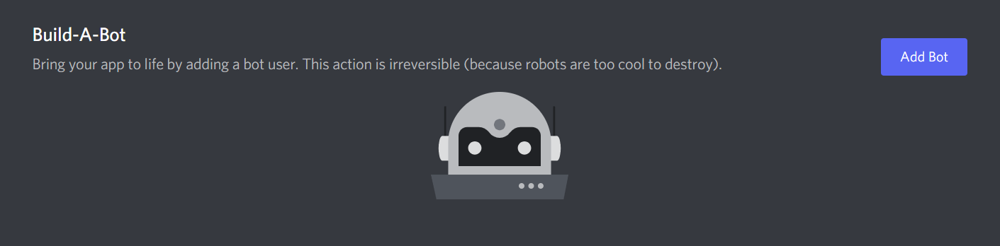
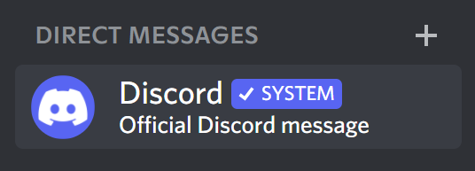

# Creating your application

The steps mentioned further in this markdown are essentially a copy of the steps
[mentioned in the documentation]({{disnakedocs}}/discord.html). Therefore, you can follow the steps from either
resource.

!!! Note

    If you have already made your bot application, you can skip this document and move on to [`initial-files`](../100-getting-started/101-initial-files.md).

## Creating a bot account

In order to work with the library and the Discord API in general, we must first create a Discord Bot account.

Creating a Bot account is a pretty straightforward process.

1. Make sure you’re logged on to the [Discord website]({{discord}}).

2. Navigate to the [application page]({{devportal}}).

3. Click on the `New Application` button.

    <!-- prettier-ignore -->
     
        

            
        

     

4. Give the application a name and click `Create`.

    <!-- prettier-ignore -->
     
        

            
        

     

5. Create a Bot User by navigating to the `Bot` tab and clicking `Add Bot`.

    - Click `Yes, do it!` to continue.

    <!-- prettier-ignore -->
     
        

            
        

     

6. Make sure that `Public Bot` is ticked if you want others to invite your bot.

    - You should also make sure that `Require OAuth2 Code Grant` is unchecked unless you are developing a service that
      needs it. If you’re unsure, then **leave it unchecked**.

    <!-- prettier-ignore -->
     
        

            
        

     

7. Copy the token using the `Copy` button.

    - This is **not** the Client Secret at the General Information page.

And that’s it. You now have a bot account and you can login with that token.

## Regarding bot tokens

!!! Danger

    This section is critical, so pay close attention. It explains what your bot token is, as well as the security aspects of it.

### What is a token, anyway?

It should be worth noting that the token is **essentially your bot’s password**. You should **never** share this with
someone else. In doing so, someone can log in to your bot and do malicious things, such as leaving servers, ban all
members inside a server, or pinging everyone maliciously.

Tokens look like this: `OTA4MjgxMjk4NTU1MTA5Mzk2.YYzc4A.TB7Ng6DOnVDlpMS4idjGptsreFg` (don't worry, we immediately reset
this token before even posting it here!). If it's any shorter and looks more like this:
`CR8UbizwLgyES9LuHK7eIrXHbRTuqoEs`, you copied your client secret instead. Make sure to copy the token if you want your
bot to work!

### Token leak scenario

Let's imagine that you have a bot on over 1,000 servers, and it took you many, many months of coding and patience to get
it on that amount. Your token gets leaked somewhere, and now someone else has it. That person can:

-   Spam every server your bot is on;
-   DM spam as many users as possible;
-   Delete as many channels as possible;
-   Kick or ban as many server members as possible;
-   Make your bot leave all of the servers it has joined;
-   Access and damage the underlying infrastructure (your server).

All that and much, much more. Sounds pretty terrible, right? So make sure to keep your token as safe as possible! In the
[initial files](../100-getting-started/101-initial-files.md) page of the guide, we cover how to safely store your token
in a configuration file.

!!! Danger

    If you accidentally leaked your token, click the “Regenerate” button as soon as possible. This revokes your old token and re-generates a new one. Now you need to use the new token to login.

## Discord's system messages

System messages are official messages that Discord sends to alert you of an account issue. These messages can range from
a variety of payment issues, support ticket updates, and ToS violation warnings. You can also expect a system message if
your bot token has been posted on the internet publicly, and was found by Discord.

**Such a message will look as follows:**

 
    

        
    

 

!!! Warning

    Since we do not know the extent to which Discord searches for bot tokens, or the time taken to inform the user about where the bot was found, we recommend not fully depending on this feature. But incase your bot token *is* found on the internet publicly (say, on  [a GitHub repository](https://www.github.com/)), you can expect Discord to send a system message to the account the bot is linked to.

Note that Discord will never ask for your password or account token, and a system message will never request for the
same. System messages from Discord will have a verified `SYSTEM` tag, and the bar at the bottom of the DM will mention -
"This thread is reserved for official Discord notifications".

 
    

        
    

 

You can read more about the authenticity of these messages [in this article][discord-sys-msg-page].

[discord-sys-msg-page]: https://support.discord.com/hc/en-us/articles/360036118732-Discord-System-Messages
